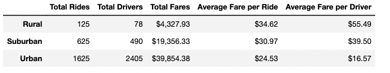

# Pyber_Analysis - Module 5: Pyber Ride Share Data

## Overview of Analysis

### Purpose

The head of a popular ride sharing app, V. Isualize,  has asked you to summarize data from two different data sets so they could make informed business decisions for Pyber. First, we'll create a data frame to review the data by city types: Urban, Suburban, and Rural. Then, using Pandas and Matplotlib libraries, we'll create a multiple-line graph to show the total weekly fares for each city type.

### Objectives

Effectivly use Pandas and Matplotlib to Identify trends or patterns in the data that could improve Pyber's business. In addition, identify any other data or topics that could be useful for future analysis. 

## Results & Analysis

Displayed below is a data frame organized by city types: Urban, Suburban, and Rural. 

As the data shows, the Urban city type has the highest 'Total Rides' , 'Total Drivers' and 'Total Fares'. However, the Rural city type has higher 'Average Fare per Ride' and 'Average Fare per Driver'. This makes sense, as there are less people in rural areas. In addition, the distance of trips in Rural areas should generally be longer. So we would expect a higher average fare for rides and drivers in Rural trips. 

### Analysis of Ride Share Data

Displayed below is a multiple-line chart of total fares for each city type: Urban, Suburban, and Rural. 

As show in the chart, Urban area's bring in the most 'Total Fares', Suburban area's the second most, and Rural areas the least amount of total fares. However, there are a number of trends across time for city types. For example, all types increase fares in the later part of February before dropping back down in March. 

### Summary & Recommendations

I would make three key recommendation to V. Isualize:
 1. 
 2.
 3. 

